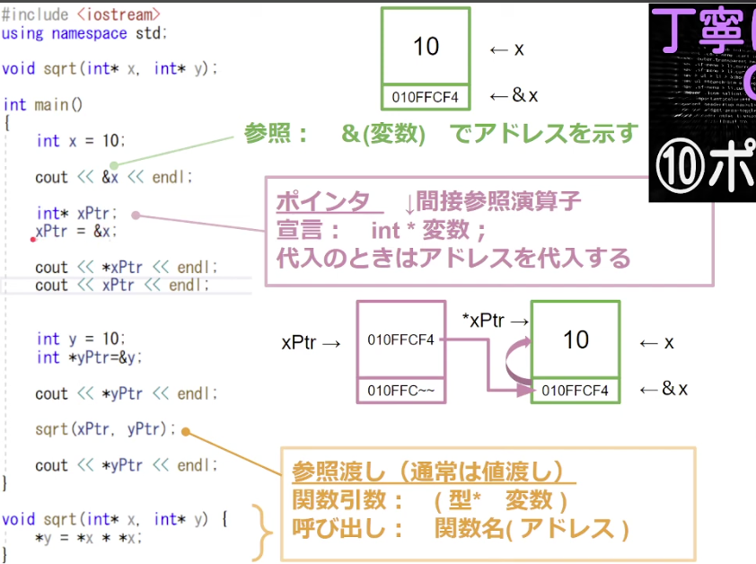

# 環境構築

MacOSでC++17を使うという前提

## コンパイラの準備

```bash
xcode-select --install

clang++ --version
```

## Homebrewからも準備

```bash
brew install gcc

g++-15 --version   # (インストールされたバージョンで変わる)
```

## VSCode拡張を導入

- C/C++ (ms-vscode.cpptools). 
  → IntelliSense、デバッグ、コード補完
- CMake Tools. 
  → プロジェクトが大きくなると必須
- CodeLLDB. 
  → デバッグ用（LLDBベース）

## Hello World

```c++
// hello.cpp
#include <iostream>
using namespace std;

int main() {
    cout << "Hello, Modern C++!" << endl;
    return 0;
}
```

ビルド

`-o`はアウトプットファイルを表す。

```bash
clang++ -std=c++17 hello.cpp -o hello
./hello
```

## CMake環境

`CMakeLists.txt`に設定などを書いてビルドの準備をする。

```cmake
cmake_minimum_required(VERSION 3.16)
project(HelloModernCXX LANGUAGES CXX)

set(CMAKE_CXX_STANDARD 17)
set(CMAKE_CXX_STANDARD_REQUIRED ON)

add_executable(hello hello.cpp)
```

```bash
# ビルドはディレクトリを分けたい
mkdir build && cd build
# CMakeLists.txtを読み込むために親ディレクトリに移動
cmake ..
# ビルドコマンド
make 
# 実行コマンド
./hello
```

# ポインタの概念

- 重要ポイント
  - 通常は値渡し（コピーが渡される）
  - 参照渡しはポインタ（アドレス）を渡す
    - こうすることで、値を直接操作できる！
    - 不要なコピーをしなくていいのでメモリの節約！



[参考](https://www.youtube.com/watch?v=HJ-R_c_jazc&list=PLcuLcFhI8wDCpZlr2J-MY5gHECi6RBn9o&index=11)

# クラス

- 中にクラス変数やメソッドを定義できる
  - privateとpublicがある
  - 基本的にはprivateで変更したくない（気軽に触って欲しくない変数を定義）
  - publicにgetter, setterを用意しておく
  - メンバ変数にアクセスや変更をしたい時は、関数を通して行う

## コンストラクタとデストラクタ

public内に関数名のようにクラス名を記述すれば良い

継承している場合は、基底クラスのコンストラクタから呼ばれ、派生クラスのコンストラクタが呼ばれる。

デストラクタはmain関数が終わった後メモリを解放するために呼ばれる。

順番は逆になって派生デストラクタ→基底デストラクタとなる

